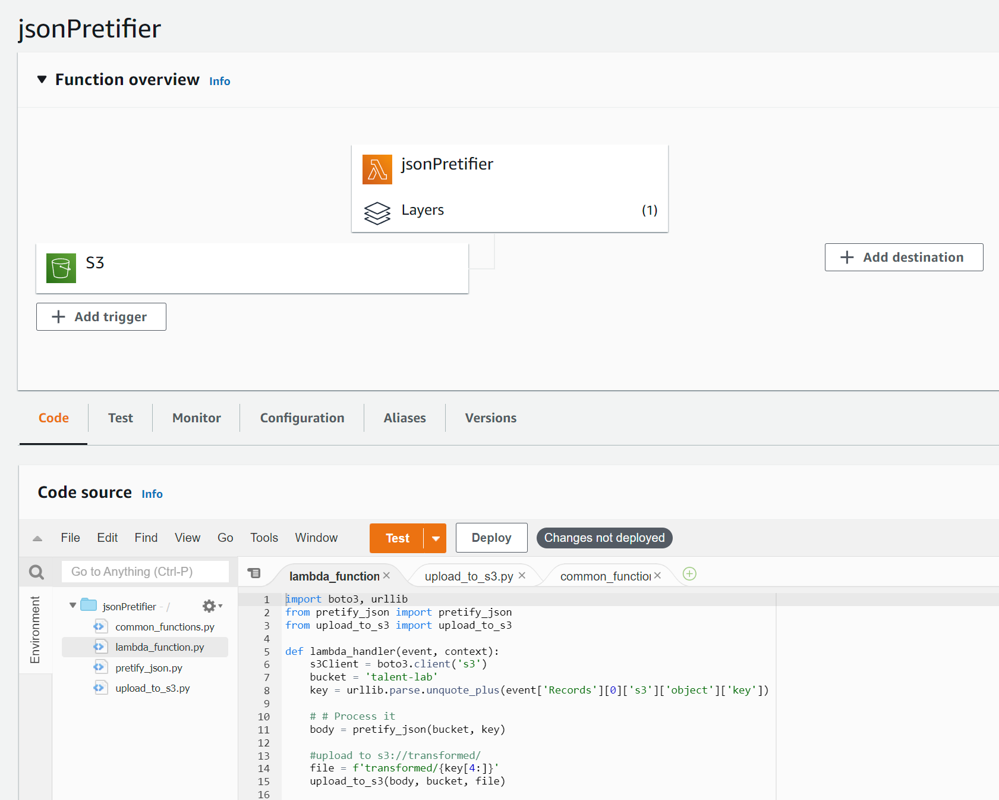
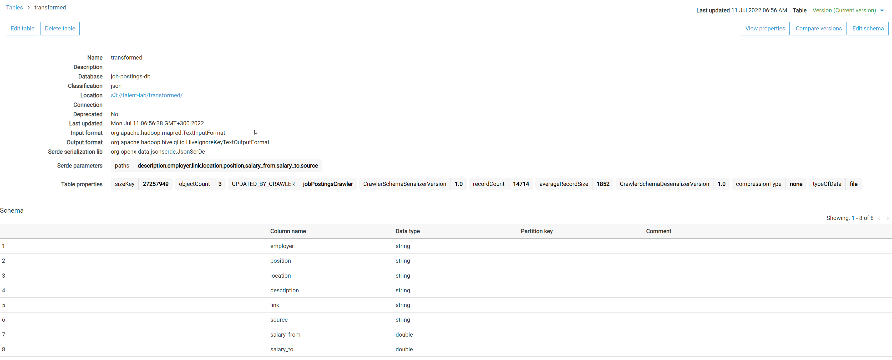
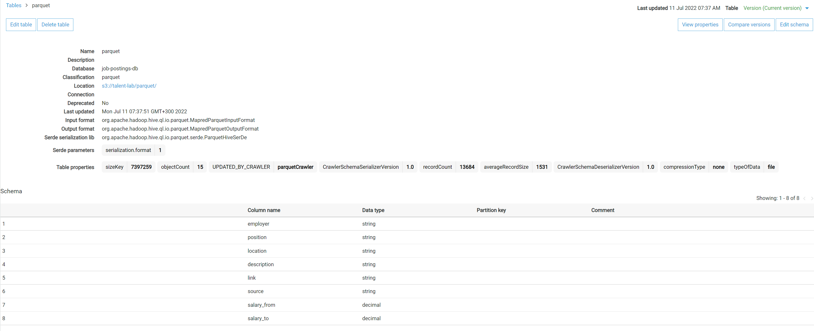
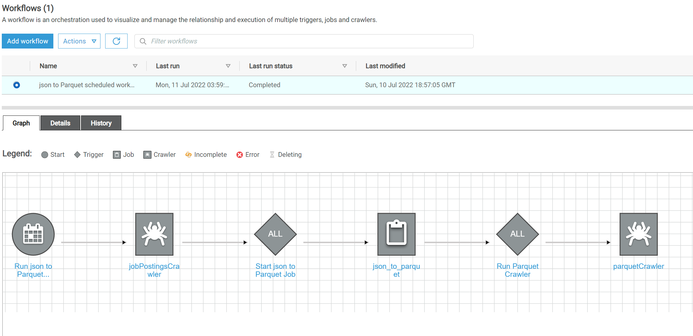
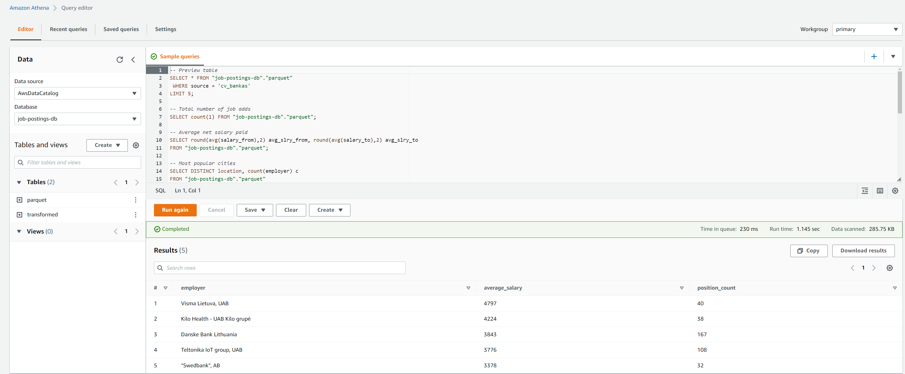
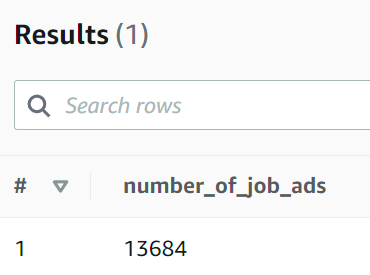
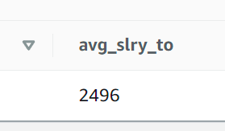
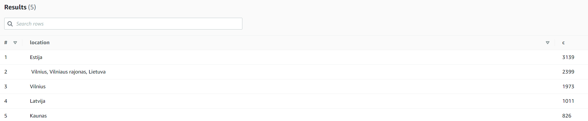
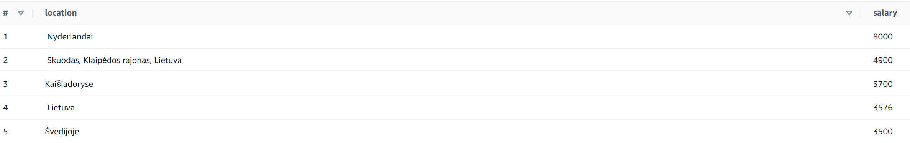
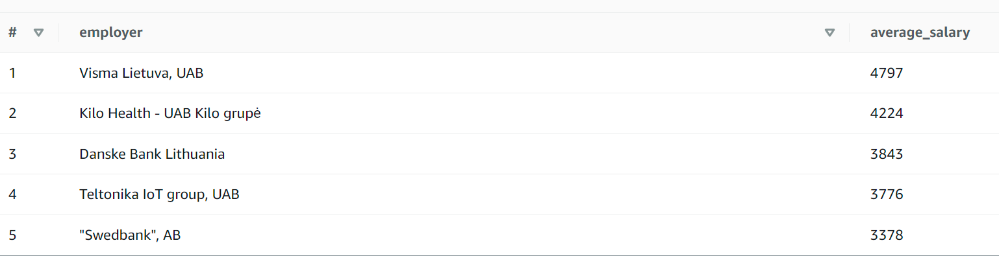

## Pipeline structure and notes
Data is scraped from:

 [cvbankas.lt](https://cvbankas.lt)
 [cvmarket.lt](https://cvmarket.lt)
 [cvmarket.lt](https://cv-online.lt)

### Data Scraping
Data scraping is performed by [three separate scripts](code) using request-html module. Script is extracting data from main site and follows a link to a main jpb add description, where it crawls job add details.

Script is looping trough pagination and saving data as dictionary and finaly to json file.
Lastly [scipt](code/upload_to_s3.py) uploads json results to S3 bucket.

### Lambda transformation
Raw folder contains raw data as extracted. Additional trnasformations are needed to make data usable:
- get salary data from string array. Salary array contains word strings ex. ['nuo 1500 iki 2000'], etc and numbers as strings. Function takes raw salary field array and extracts numbers as floats, i.e. [1500, 2000].
- to make analysis usable all salaries need to be identified beiing nett or gross. It is done by identifying key words like: 'neatskaičius', 'gross' and converting it to standard 'before tax' or 'after tax'
- after unification of payment methods another function takes salary payment method ('before_tax') and if it is true, converts salary to nett, also splitting salary field to 'from' and 'to' fields.

Lambda function uses Pandas library imported as a layer.

Resulting dataframe is converted to json and is uploaded to S3://transformed.

### AWS Glue workflow
For further transformation I have chosen to use Glue. I have created two crawlers:
- first takes all json files from s3://transformed and creates a database 'job-postings-db' and a table 'transformed'

- second takes all json files from s3://transformed and converts it to parquet (for further analysis in Spark (part to be done)) in a database 'job-postings-db' and a table 'parquet'

To enable continuous operation I have created a workflow that is scheduled to run weekly:

### Data analysis with Athena

In a scope of a project development environment, I wll use Athena for analytics. For production environment, data visualisation woul be deployed ex. hex, Google Data Studio, Tableu, Power Bi, etc. 

Sample dashboard on Hex platfor is [here](https://app.hex.tech/c30abd41-93ac-4b26-9b75-d7e46b16673e/app/f64c5f6a-7fb0-416e-914a-553c80078219/latest)

Few interesting observations as of 2022 July 11:
1. Number of posted job ads:

2. Average salary to offered:

3. Most popular locations:

5. Best paid locations:

6. Best paying employers:

