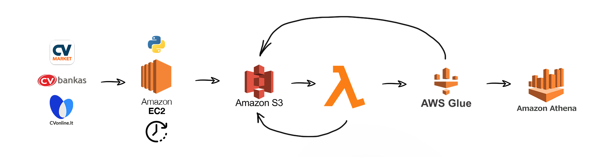

# Introduction
This repository contains a workflow of extracting loading and transforming of most pupular job ad listing services in Lithuania (cv-online.lt, cvbankas.lt and cvmarket.lt). Job ad sites are scraped regularly by EC2 virtula instance running a cron job, once a week and data is loaded to AWS cloud to run a Lamda function for transformations. After that, Glue workflow makes a conversion of initial json format to parquet, cretaes a database and tables in Glue Data Catalogue for further analysis in Athena.

## Problem Description
As a result of workflow the task is to hava a database of job postings where it would be possible quickly search and make a analysis for:
 - jobs
 - salary trends
 - most popular employers
 - best paying employers
 - best paid positions
 - etc

## Technologies used
- Cloud: AWS
- Infrastructute as Code: Terraform
- Data orchestration: cron, Glue
- Data Warehouse: S3
- Batch Processing: Lambda

### Architecture diagram

## Approach to Problem
 1. [Create infrastructure for GCP via Terraform](code/terraform/main.tf):
   - [create EC2 instance](https://eu-central-1.console.aws.amazon.com/ec2/v2/home?region=eu-central-1#Instances:instanceState=running)
   - create virtual environment, copy scraper files and run crontab
 2. [Security infrastructure](security_infrastructure.md)
   - create policy alowing access to S3 bucket
   - create roles for S3, Lambda and Glue
   - asign policies to roles
 3. [Design a pipeline](pipeline.md)
   - create [python scripts](code) for scraping of websites and uplod results to S3 with cron job
   - create lambda function to make transformations upon change event on S3 folder
   - make a Glue workflow to cretae database, tables and transform json to parquet format
   - analise with Athena

